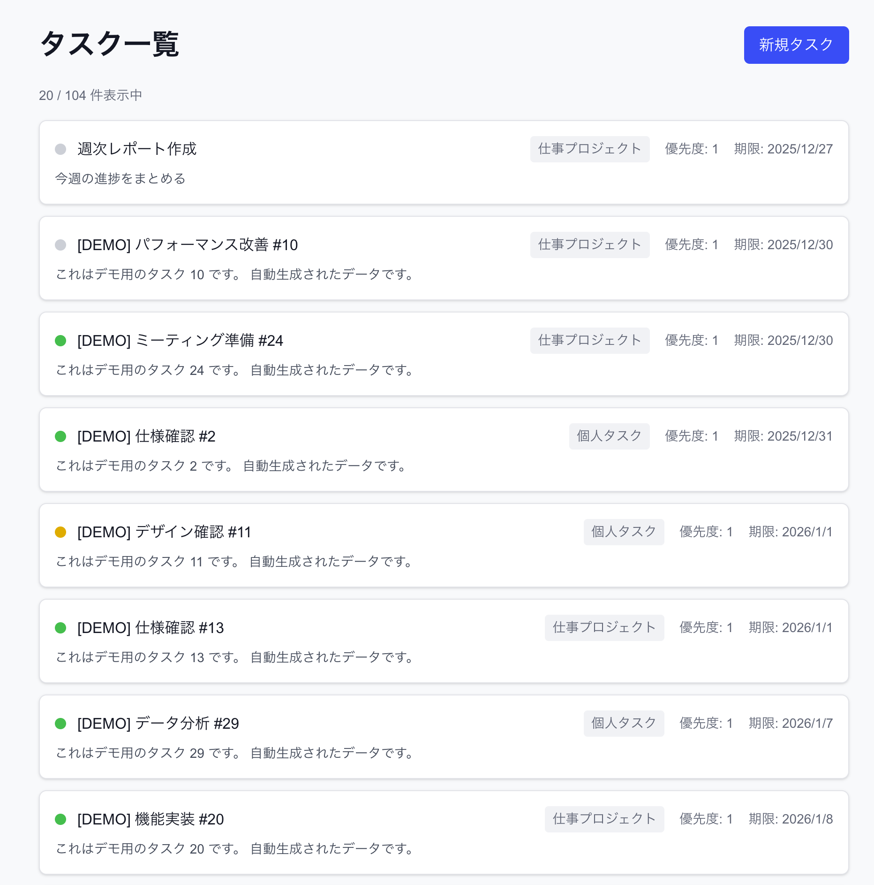
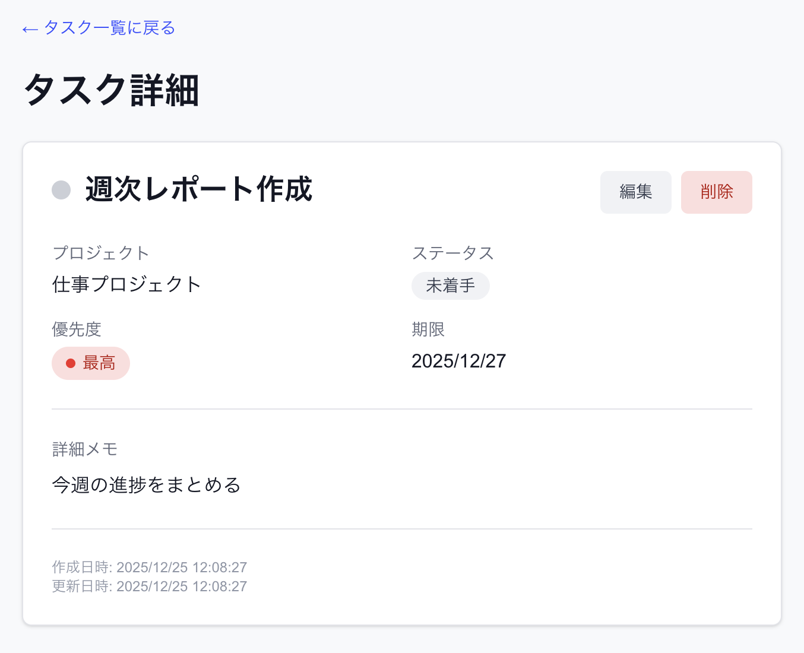

# TODO管理アプリ

Next.js App Router + Prisma + PostgreSQL で構築したタスク管理Webアプリケーションです。

## 🎯 サービス概要

シンプルで使いやすいTODO管理サービスです。Google認証でログインし、プロジェクト単位でタスクを管理できます。

### スクリーンショット

| タスク一覧 | タスク詳細 |
|-----------|-----------|
|  |  |

## ✨ 機能一覧

### 認証機能
- Google OAuth 2.0 によるログイン/ログアウト
- 認証済みユーザーのみアクセス可能（Middleware による保護）

### タスク管理
- タスク一覧表示（無限スクロール対応）
- タスク詳細表示
- タスク作成
- タスク編集
- ステータス管理（未着手 / 進行中 / 完了）
- 優先度設定（5段階）
- 期限設定

### プロジェクト管理
- プロジェクト一覧表示
- プロジェクト単位でのタスク分類

## 🛠️ 技術スタック

| カテゴリ | 技術 |
|---------|------|
| フロントエンド | Next.js 16 (App Router), React 19, TypeScript |
| スタイリング | Tailwind CSS 4 |
| バックエンド | Next.js Server Actions, API Routes |
| データベース | PostgreSQL 16 |
| ORM | Prisma 7 |
| 認証 | NextAuth.js v5 (Auth.js) |
| コンテナ | Docker, Docker Compose |
| タスクランナー | Taskfile |

## 📊 データベース設計

### ER図

```
┌─────────────┐       ┌─────────────┐       ┌─────────────┐
│    users    │       │  projects   │       │    tasks    │
├─────────────┤       ├─────────────┤       ├─────────────┤
│ id (PK)     │──┐    │ id (PK)     │──┐    │ id (PK)     │──┐
│ email       │  │    │ user_id(FK) │←─┘    │ project_id  │←─┘
│ name        │  │    │ name        │       │ title       │
│ google_id   │  │    │ deleted_at  │       │ description │
│ created_at  │  └───→│ created_at  │       │ status      │
│ updated_at  │       │ updated_at  │       │ priority    │
└─────────────┘       └─────────────┘       │ due_date    │
                                            │ deleted_at  │
                                            │ created_at  │
                                            │ updated_at  │
                                            └─────────────┘
```

### テーブル一覧

#### users テーブル
Google認証ユーザーを管理

| カラム名 | 型 | 説明 |
|---------|-----|------|
| id | UUID | ユーザーID（PK） |
| email | VARCHAR | メールアドレス（ユニーク） |
| name | VARCHAR | 表示名 |
| google_id | VARCHAR | GoogleのユーザーID（ユニーク） |
| created_at | TIMESTAMP | 作成日時 |
| updated_at | TIMESTAMP | 更新日時 |

#### projects テーブル
プロジェクト（タスクのグループ）を管理

| カラム名 | 型 | 説明 |
|---------|-----|------|
| id | UUID | プロジェクトID（PK） |
| user_id | UUID | 所有ユーザーID（FK） |
| name | VARCHAR | プロジェクト名 |
| deleted_at | TIMESTAMP | 削除日時（論理削除） |
| created_at | TIMESTAMP | 作成日時 |
| updated_at | TIMESTAMP | 更新日時 |

#### tasks テーブル
TODOタスクを管理

| カラム名 | 型 | 説明 |
|---------|-----|------|
| id | UUID | タスクID（PK） |
| project_id | UUID | プロジェクトID（FK） |
| title | VARCHAR | タイトル |
| description | TEXT | 詳細メモ |
| status | VARCHAR | ステータス（todo/doing/done） |
| priority | INTEGER | 優先度（1:最高 〜 5:最低） |
| due_date | DATE | 期限 |
| deleted_at | TIMESTAMP | 削除日時（論理削除） |
| created_at | TIMESTAMP | 作成日時 |
| updated_at | TIMESTAMP | 更新日時 |

## 🚀 実行方法

### 前提条件

- Docker & Docker Compose
- [Task](https://taskfile.dev/) （タスクランナー）
- Google Cloud Console のアカウント（OAuth設定用）

### 1. リポジトリのクローン

```bash
git clone https://github.com/your-username/todo-app-nextjs.git
cd todo-app-nextjs
```

### 2. 環境変数の設定

`.env` ファイルをプロジェクトルートに作成：

```bash
# データベース接続
DATABASE_URL="postgresql://postgres:password@db:5432/todo-app-db"

# Google OAuth（後述の手順で取得）
GOOGLE_CLIENT_ID="your-client-id.apps.googleusercontent.com"
GOOGLE_CLIENT_SECRET="your-client-secret"

# NextAuth用シークレット（下記コマンドで生成）
AUTH_SECRET="your-random-secret"
```

**AUTH_SECRET の生成：**
```bash
openssl rand -base64 32
```

### 3. Google OAuth の設定

1. [Google Cloud Console](https://console.cloud.google.com/) にアクセス
2. 新しいプロジェクトを作成（または既存を選択）
3. 「APIとサービス」→「認証情報」→「認証情報を作成」→「OAuthクライアントID」
4. アプリケーションの種類：「ウェブアプリケーション」
5. 承認済みのリダイレクトURI に追加：
   ```
   http://localhost:3000/api/auth/callback/google
   ```
6. 「クライアントID」と「クライアントシークレット」を `.env` に設定

### 4. 初回起動

```bash
# サービス起動（DB + Next.js）
task up

# 別ターミナルでマイグレーション実行
task migrate

# シードデータ投入
task seed
```

### 5. アクセス

http://localhost:3000 にアクセス

### 6. 停止

```bash
task down
```

## 📋 利用可能なコマンド

| コマンド | 説明 |
|---------|------|
| `task up` | 🚀 開発サーバーを起動（DB + Next.js） |
| `task down` | ⏹️ 開発サーバーを停止 |
| `task migrate` | 📦 マイグレーションを実行 |
| `task generate` | 🔧 Prisma Clientを生成 |
| `task seed` | 🌱 シードデータを投入 |
| `task seed-demo` | 🎲 デモ用タスク100件を生成 |
| `task reset` | 🔄 DBリセット（全削除→マイグレ→シード） |
| `task studio` | 🔍 Prisma Studio起動（http://localhost:5555） |

## 🧪 テストデータ

### 基本シードデータ（task seed）

- テストユーザー: 1名
- プロジェクト: 2件（個人タスク、仕事プロジェクト）
- タスク: 4件（各ステータスのサンプル）

### デモデータ（task seed-demo）

- タスク: 100件（ランダム生成）
- タイトルに `[DEMO]` プレフィックス付き
- 再実行で古いデモデータを削除して再生成

## 📁 ディレクトリ構成

```
todo-app-nextjs/
├── app/
│   ├── api/
│   │   └── auth/[...nextauth]/    # NextAuth APIルート
│   ├── components/
│   │   ├── auth/                  # 認証関連コンポーネント
│   │   └── tasks/                 # タスク関連コンポーネント
│   ├── lib/
│   │   ├── actions/               # Server Actions
│   │   ├── data/                  # データ取得関数
│   │   ├── auth.ts                # NextAuth設定
│   │   ├── auth.config.ts         # 認証設定（Edge互換）
│   │   └── prisma.ts              # Prisma Client
│   ├── login/                     # ログインページ
│   ├── projects/                  # プロジェクト一覧
│   ├── tasks/
│   │   ├── new/                   # タスク作成
│   │   └── [taskId]/              # タスク詳細・編集
│   ├── layout.tsx
│   └── page.tsx                   # タスク一覧（トップページ）
├── prisma/
│   ├── migrations/                # マイグレーションファイル
│   ├── schema.prisma              # スキーマ定義
│   ├── seed.ts                    # シードスクリプト
│   └── seed-demo.ts               # デモデータ生成
├── docker-compose.yml
├── Taskfile.yml
└── README.md
```

## 🔒 セキュリティ

- Google OAuth 2.0 による認証
- Middleware によるルート保護
- CSRF保護（NextAuth組み込み）
- 環境変数による機密情報管理
